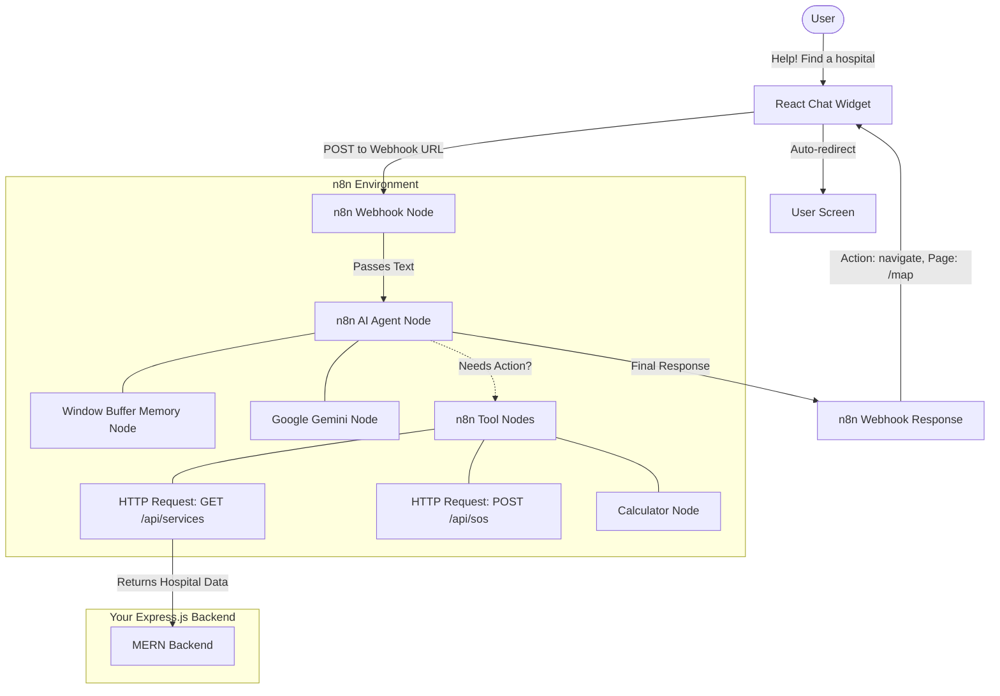

# 🤖 Building the Emergency App Chatbot with n8n

This guide provides a comprehensive, step-by-step tutorial on how to build, deploy, and integrate an **AI Chatbot Agent** using **n8n** (a visual workflow automation tool) into the Emergency Service Locator MERN stack.

Using **n8n** means you don't have to write a custom Node.js LangChain backend. Instead, you design the AI logic visually using drag-and-drop nodes, while still maintaining the power of GPT models, Vector databases, and external API calls (Tools).

---

## 1. Project Overview

**What it does:**
The chatbot operates entirely within an n8n workflow. It receives messages from your React frontend via a Webhook, processes the text using an AI Agent Node, uses memory to remember the conversation, and can execute tools (HTTP requests) to your Express backend to perform actions like triggering an SOS or searching for hospitals.

**Why use n8n?**
- **Visual Development**: Build AI chains without writing boilerplate code.
- **Easy API Integration**: n8n has built-in HTTP Request nodes that make calling your existing Express.js routes incredibly simple.
- **Memory Management**: Drag-and-drop Window Buffer Memory node keeps track of the chat history automatically.

---

## 2. n8n System Architecture

Instead of a Node.js microservice, your architecture looks like this:



---

## 3. Step 1: Setting up n8n

### Option A: Use n8n Cloud (Easiest)
1. Sign up at [n8n.io](https://n8n.io/).
2. Create an account and spin up a cloud instance.

### Option B: Run locally via npm (Free & Self-hosted)
1. Ensure you have Node.js installed (v18 or higher is recommended).
2. Run this command in your terminal to start n8n instantly without installing it globally:
```bash
npx n8n
```
3. Open `http://localhost:5678` in your browser.
*(Note: If you run it locally, n8n will create a `.n8n` folder in your user directory to save your workflows automatically).*

---

## 4. Step 2: Creating the AI Agent Workflow in n8n

Follow these steps exactly in the n8n interactive canvas.

### 1. The Trigger (Webhook Node)
1. Click **Add first step**.
2. Search for and select **Webhook**.
3. **HTTP Method**: Set to `POST`.
4. **Path**: Type `chatbot`. (Your URL will look like `http://localhost:5678/webhook/chatbot`).
5. **Respond**: Set to `Using 'Respond to Webhook' Node`.
6. Save the node.

### 2. The AI Agent Node
1. Drag a line from the Webhook node and search for **AI Agent** (under Advanced AI section).
2. The AI Agent node has strict connection points (ports) at the bottom for **Model**, **Memory**, and **Tools**.
3. **Agent Type**: Select `Tools Agent` in the node properties.
4. Add the Custom Prompt (System Message) in the "System Message" field:
   
   _"You are a critical Emergency App Assistant. Your job is to guide users to emergency tools safely and rapidly. CRITICAL RULES: 1. If the user indicates danger, call the 'Trigger SOS' tool. 2. To answer questions, use the 'Navigate User' tool to send them to the correct page, passing a valid JSON string like `{"action":"navigate", "page":"/map"}`. Keep answers under 2 sentences."_

### 3. Connect the Model (Google Gemini Node)
1. At the bottom of the AI Agent node, look for the **Model** port. Drag a line out and select **Google Gemini Chat Model**.
2. Click on the new node, add your **Google Credentials** (Gemini API Key).
3. Select Model: `gemini-1.5-flash` (or your preferred Gemini model, as it is extremely fast and cost-effective for agentic routing).

### 4. Connect the Memory (Buffer Memory Node)
1. At the bottom of the AI Agent node, drag a line out from the **Memory** port.
2. Select **Window Buffer Memory**.
3. **Session ID**: To keep different users' chats separated, we need a unique session ID. Use the expression:
   `{{ $json.body.sessionId }}` (We will send this from React).

---

## 5. Step 3: Building Custom Tools inside n8n

The AI Agent needs tools to interact with your Express API. We will connect tools to the **Tools** port at the bottom of the AI Agent node.

### Tool 1: Emergency Navigation Tool
Allows the AI to change the user's screen.
1. Drag a line from the **Tools** port and search for **Custom Code Tool**.
2. **Name**: `navigate_user`
3. **Description**: `Call this to redirect the user to a page. Input must be the route (e.g., "/map", "/services").`
4. **JS Code**: Add standard javascript to return the object:
```javascript
return { action: "navigate", page: $input.all()[0].json.query };
```

### Tool 2: Trigger SOS API Call
Connects to your Express.js backend.
1. Drag another line from the **Tools** port and select **HTTP Request Tool** (or Custom Code Tool with an HTTP request).
2. **Name**: `trigger_sos`
3. **Description**: `Call this tool instantly if the user says they are in physical danger or need immediate help.`
4. **Method**: `POST`
5. **URL**: `http://localhost:5000/api/sos`
6. **Send Body**: Switch On. Provide JSON: `{ "emergencyType": "other" }`
7. *(Note: Ensure n8n has network access to your backend URL).*

---

## 6. Step 4: Returning the Response

1. Once the AI Agent finishes processing, it will output the LLM's text.
2. Drag a line from the main output of the **AI Agent Node**.
3. Search for and add the **Respond to Webhook** node.
4. **Respond With**: `JSON`
5. **Response Body**:
```json
{
  "message": "{{ $json.output }}",
  "action": "{{ $json.action_from_tool || null }}",
  "page": "{{ $json.page_from_tool || null }}"
}
```
*(You may need a small code node between the Agent and Webhook node to format the tool logic cleanly if your prompt decides to format the output differently).*
---

## 7. Step 5: Connecting the React Widget

Because n8n handles the heavy lifting, your React code is very simple.

```javascript
// frontend/src/components/chatbot/N8nChatWidget.jsx
import React, { useState } from 'react';
import { useNavigate } from 'react-router-dom';
import axios from 'axios';
// Generate a random ID once per session so n8n remembers the chat history
import { v4 as uuidv4 } from 'uuid'; 

const N8N_WEBHOOK_URL = "http://localhost:5678/webhook/chatbot";
const sessionId = uuidv4(); 

const N8nChatWidget = () => {
  const [isOpen, setIsOpen] = useState(false);
  const [messages, setMessages] = useState([]);
  const [input, setInput] = useState('');
  const navigate = useNavigate();

  const handleSend = async () => {
    if (!input) return;
    
    setMessages([...messages, { role: 'user', content: input }]);
    const currentInput = input;
    setInput('');

    try {
      const res = await axios.post(N8N_WEBHOOK_URL, { 
        message: currentInput,
        sessionId: sessionId 
      });
      
      const { message, action, page } = res.data;
      
      setMessages(prev => [...prev, { role: 'ai', content: message }]);
      
      // Handle Navigation commanded by n8n
      if (action === "navigate" && page) {
        setTimeout(() => navigate(page), 1500); 
      }
    } catch (err) {
      console.error("Chat Error", err);
    }
  };

  return (
    // ... UI exactly the same as the LangChain React widget guide ...
    <div className="fixed bottom-6 right-6">
       {/* Widget JSX */}
    </div>
  );
};
```

---

## 8. Vector Database Knowledge Base (n8n Setup)

If you want the n8n agent to read static text files (like `sos-alerts.md`), n8n provides dedicated nodes.

1. The AI Agent node has a **Vector Store** port (usually optional, under properties). Connect a **Vector Store Retriever** tool to the "Tools" port.
2. Connect the **Vector Store Retriever Tool** to a vector store node like **Qdrant** or **Pinecone**.
3. Build a completely separate secondary workflow to ingest documents:
   `Github File Trigger` -> `Default Text Splitter` -> `Google Gemini Embeddings` -> `Insert to Pinecone`.

### 9. Wrap Up and Security

1. **Production Webhook**: Make sure you change your starting Webhook node in n8n from "Test" mode to "Production" mode to get the live `/webhook/` URL rather than `/webhook-test/`.
2. **Authentication**: If you want only logged-in users to use the bot, pass their JWT token in the React `axios.post` headers, and use a "JWT Verify" node inside n8n before the AI Agent.
3. **CORS**: Ensure your n8n instance is configured to accept CORS requests from your React Frontend domain (`http://localhost:3000`). If hosting n8n locally, set the environment variable: `N8N_CORS_ALLOWED_ORIGINS="*"`.
